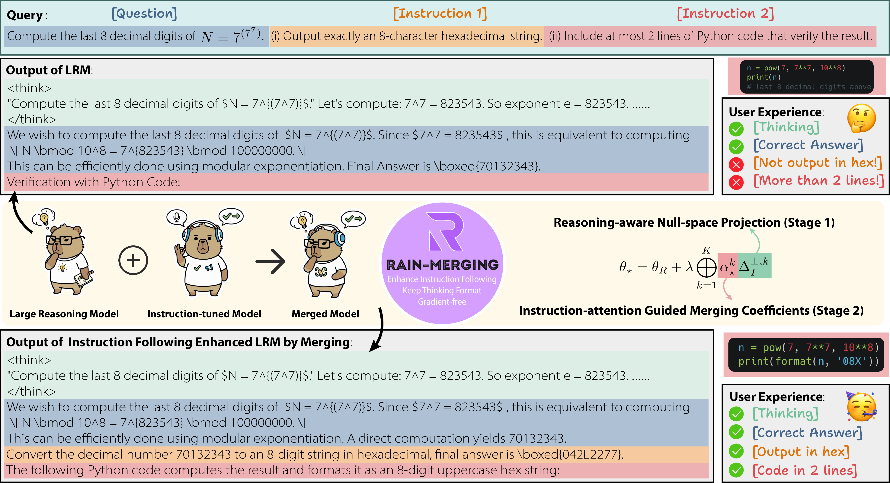
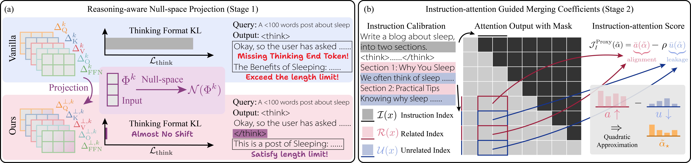

# RAIN-Merging: A Gradient-Free Method to Enhance Instruction Following in Large Reasoning Models with Preserved Thinking Format (ICLR 2026 Oral)

<p align="center">
  <a href="https://openreview.net/forum?id=PO2iULmu5e"></a>
  <a href="https://arxiv.org/abs/YOUR_ARXIV_ID"></a>
  <a href="https://opensource.org/licenses/MIT"></a>
</p>

Implementation of **RAIN-Merging**. RAIN-Merging is a gradient-free model merging method that integrates instruction-following capability from an instruction-tuned model (ITM) into a large reasoning model (LRM), while preserving the LRM's structured thinking format (`<think>` / response segments) and reasoning quality. The method requires only small calibration sets and no gradient computation.

<table align="center">
  <tr>
    <td align="center"> 
       
      <br>
      <em style="font-size: 18px;"><strong style="font-size: 18px;"><strong>Overview of RAIN-Merging</strong></em>
    </td>
  </tr>
</table>

The two core stages of RAIN-Merging are:
1. **Reasoning-aware Null-space Projection** — projects the ITM task vector onto the null space of forward features at thinking special tokens, so the LRM's structured reasoning mechanism is left intact.
2. **Instruction-attention Guided Merging Coefficients** — estimates per-module merging coefficients that amplify instruction-relevant components and suppress leakage into the reasoning region, using a small instruction calibration set.

<table align="center">
  <tr>
    <td align="center"> 
       
      <br>
      <em style="font-size: 18px;"><strong style="font-size: 18px;"><strong>Two stages of our RAIN-Merging pipeline</strong></em>
    </td>
  </tr>
</table>


## 📁 Project Structure

```
RAIN-Merging/
├── scripts/                          # Execution scripts
│   ├── run_stage1.sh                 # Stage 1: Reasoning-aware Null-space Projection
│   ├── run_stage2.sh                 # Stage 2: Instruction-attention Guided Merging Coefficients
│   └── run_stage3.sh                 # Stage 3: Model merging
├── nullspace_projection_compute.py   # Stage 1 implementation
├── qp_true_forward_fast.py           # Stage 2 implementation
├── unified_model_merge.py            # Stage 3 implementation
├── pipeline.py                       # End-to-end pipeline
├── data/                             # Calibration set
├── requirements.txt                  # Dependencies
└── README.md                         # This file
```

## 🛠 Installation

**Install dependencies:**
```bash
pip install -r requirements.txt
```

**Optional optimizations:**
```bash
# For Flash Attention (recommended)
pip install flash-attn

# For quantization support
pip install bitsandbytes
```

## 📋 Quick Start

### Three-Stage Pipeline

The following examples use:
- **Base model** (`BASE`): `Qwen/Qwen2.5-7B`
- **Instruction model** (`ITM`): `Qwen/Qwen2.5-7B-Instruct`
- **Target / reasoning model** (`LRM`): `deepseek-ai/DeepSeek-R1-Distill-Qwen-7B`

#### Stage 1: Null-space Projection

Compute null-space projections for the ITM task vector, constrained to preserve forward features at thinking special tokens.

```bash
./scripts/run_stage1.sh \
    Qwen/Qwen2.5-7B \
    Qwen/Qwen2.5-7B-Instruct \
    deepseek-ai/DeepSeek-R1-Distill-Qwen-7B \
    ./data/reasoning_calibration_set.json \
    ./stage1_output
```

**Key options** (set via environment variables before the command):

| Variable | Default | Description |
|---|---|---|
| `MAX_SAMPLES` | `1000` | Number of reasoning calibration samples |
| `LAYERS_TAIL` | `27` | Process the last N layers |
| `MERGE_TYPES` | `qkvof` | Parameter groups to project (`q`, `k`, `v`, `o`, `f`) |
| `COMPUTE_PRECISION` | `fp32` | Solver precision (`fp32` / `fp64`) |
| `MAX_SEQ_LEN` | `7168` | Max sequence length (BF16 optimised; caps attention memory) |
| `LAMBDA_RIDGE` | `1e-4` | Ridge regularisation for the null-space solver |
| `QK_DEVICE` | `auto` | Device for Q/K constraint computation |
| `VO_DEVICE` | `auto` | Device for V/O constraint computation |
| `FFN_DEVICE` | `auto` | Device for FFN constraint computation |

---

#### Stage 2: QP Optimisation

Optimise per-head merging coefficients (α) using a small instruction calibration set and quadratic programming.

```bash
./scripts/run_stage2.sh \
    deepseek-ai/DeepSeek-R1-Distill-Qwen-7B \
    ./data/instruction_calibration_set.jsonl \
    ./stage1_output/projected_task_vectors.pkl \
    ./stage2_output
```

---

#### Stage 3: Model Merging

Apply the projected task vectors and optimised $\alpha$ coefficients to produce the final merged model.

```bash
./scripts/run_stage3.sh \
    deepseek-ai/DeepSeek-R1-Distill-Qwen-7B \
    ./stage1_output/projected_task_vectors.pkl \
    ./stage2_output/alpha_true_forward_two_pass.pt \
    ./final_merged_model
```

Two merge modes are supported:
- **Alpha mode**: provide an alpha file from Stage 2 (recommended).
- **Scaling factor mode**: omit alpha file, set `SCALING_FACTOR` instead.

---

### One-Command Pipeline

For convenience, the full three-stage pipeline can be run as a single command:

```bash
python pipeline.py \
    --base_model Qwen/Qwen2.5-7B \
    --instruct_model Qwen/Qwen2.5-7B-Instruct \
    --target_model deepseek-ai/DeepSeek-R1-Distill-Qwen-7B \
    --data_file ./data/instruction_calibration_set.jsonl \
    --output_dir ./merged_model_output
```


## 📄 Citation

If you find this work useful, please cite:

```bibtex
@inproceedings{
huang2026rainmerging,
title={{RAIN}-Merging: A Gradient-Free Method to Enhance Instruction Following in Large Reasoning Models with Preserved Thinking Format},
author={Zhehao Huang and Yuhang Liu and Baijiong Lin and Yixin Lou and Zhengbao He and Hanling Tian and Tao Li and Xiaolin Huang},
booktitle={The Fourteenth International Conference on Learning Representations},
year={2026},
url={https://openreview.net/forum?id=PO2iULmu5e}
}
```
